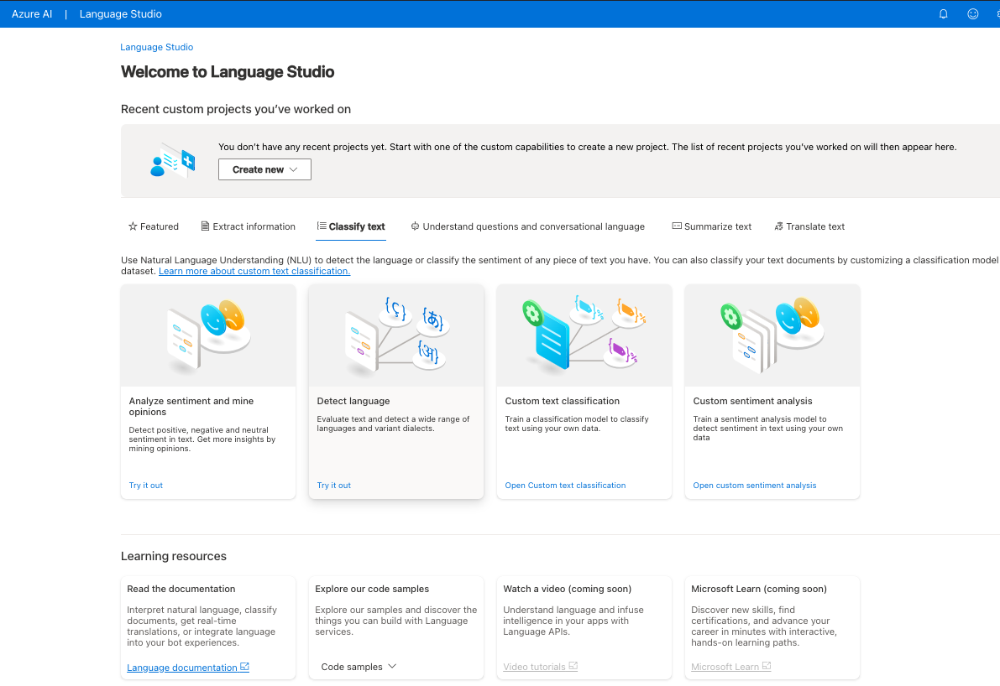

# language-studio-Azure

## Descrição

Neste projeto nós experimentamos um dos recursos disponíveis no Azure AI Studio.
Dentro do Language Studio, escolhemos a categoria "Classify Text" e depois a fature
"Analyze sentiment and mine opinions" para extrair os "sentimentos" de exemplos fornecidos
em diversos formatos.

### Ou poderia ser, por exemplo, "Linguagem de Conversação" ou "Compreender Perguntas":

## Resultados

